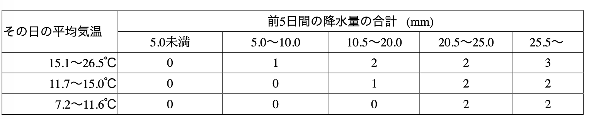

  
**「感染好適指数」の計算方法**

①　１日の平均気温が26.6℃未満でかつ最低気温が7.2℃以上の場合、以下の区分に従って感染好適指数を割り当てる。

②　上記の表で感染好適指数が０であっても、当日0.5㎜以上の降水があり、平均気温が7.2℃以上の場合、感染好適指数を１とする。

③　最低気温が7.2℃未満であっても、前5日間の降水量の合計が30㎜以上で、平均気温が7.2℃以上なら、感染好適指数を２とする。

④　感染好適指数の累積値が５以下の場合で、前10日間の降水量の合計が０なら、それまでの累積値を０とする。

⑤　平均気温が26.6℃以上の日は感染好適指数のそれまでの累積値を０に戻す。

　　＊注1：平成２年度の農業試験会議資料では前５日間の降水量の区分が「～5、6～10、11～20、 21～25、26～」となっていますが、現在は 上記の表のように降水量の刻み方を「0.5㎜単位」とし計算しています。

　　＊注2：FLABSでは平均気温を日最高気温と日最低気温の算術平均として計算しています。