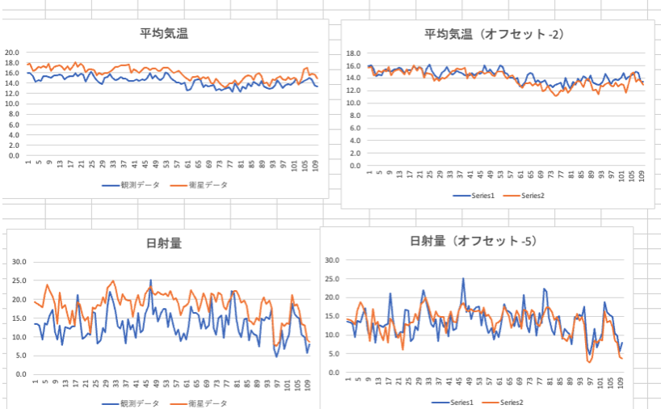
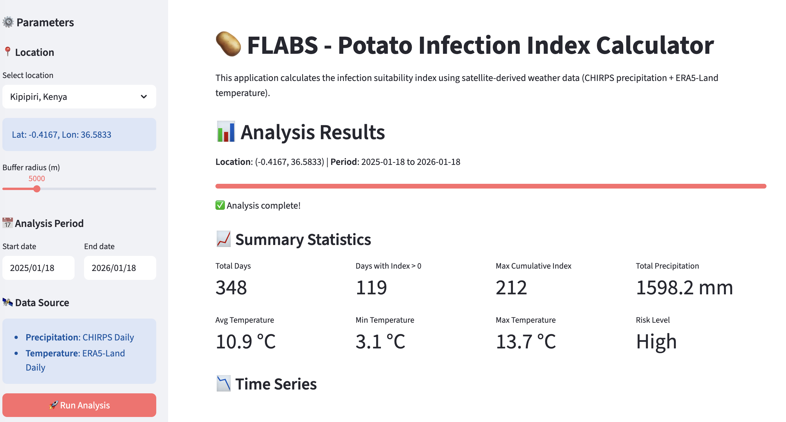

# Potato Disease & Yield Prediction System using Satellite Data


## FLABS - Satellite

```                                              
  # GEE版の実行                                          
  source venv/bin/activate                               
  python kipipiri_flabs.py                               
                                                         
  # Open-Meteo版の実行                                   
  python kipipiri_flabs_openmeteo.py                     
                                                         
  GEE版はCHIRPS（降水量専用の高精度衛星データ）とERA5-Lan
  d（気温）を使用しており、Open-Meteo版より精度が高いデー
  タソースを利用しています。
```

#### 北海道立総合研究機構のページ
[http://www.agri.hro.or.jp/boujosho/flabs/area.html](http://www.agri.hro.or.jp/boujosho/flabs/area.html)


## Ⅰ．FLABSとは

FLABSは気象データのうち「最高気温」「最低気温」「平均気温」「降水量」の４要素を用いてばれいしょ疫病の[「感染好適指数」](http://www.agri.hro.or.jp/boujosho/flabs/kansen.html)を算出し、初発日を予測するシステムです。 「感染好適指数」の計算は萌芽日から開始し、その累積値が**「２１」**に達した日を**「危険期到達日」**として「初発日」を予測します。**「予測初発日」**は「危険期到達日」のおよそ２週間後ですが、その対応関係は[別添の表](http://www.agri.hro.or.jp/boujosho/flabs/shohatsu.html)を参照してください。

## Ⅱ．利用上の注意点

・　「予測初発日」と「危険期到達日」の関係は農業試験場のほ場における永年の観測結果を基に導き出されています。実際の初発日は、その７０％が予測初発日の前後５～10日間（＝計10～20日間）に収まることになります。

・Ｈ４～６年に行われたFLABSの現地実証試験において「危険期到達日」より早く初発する地点が一部で認められました。FLABSはあくまでも初発予測の目安であって、ほ場観察をきちんと行い、適期防除を失しないことが重要です。

## Ⅲ．萌芽日の調整

FLABSの計算は各地の作況ほにおける萌芽日を利用して行っています。各ほ場・各品種における萌芽日に合わせて、FLABSの計算結果を修正することができます。

・萌芽日が作況ほより早い場合

本システムでは修正できません

・萌芽日が作況ほより遅い場合

「感染好適指数の累積値」から、そのほ場の萌芽日の前日における感染好適指数の累積値をひいた値。 作況ほでの累積値が21を超えたあとも10日間計算を継続します（緑字で表示）。

  
##「感染好適指数」の計算方法


①　１日の平均気温が26.6℃未満でかつ最低気温が7.2℃以上の場合、以下の区分に従って感染好適指数を割り当てる。


②　上記の表で感染好適指数が０であっても、当日0.5㎜以上の降水があり、平均気温が7.2℃以上の場合、感染好適指数を１とする。

③　最低気温が7.2℃未満であっても、前5日間の降水量の合計が30㎜以上で、平均気温が7.2℃以上なら、感染好適指数を２とする。

④　感染好適指数の累積値が５以下の場合で、前10日間の降水量の合計が０なら、それまでの累積値を０とする。

⑤　平均気温が26.6℃以上の日は感染好適指数のそれまでの累積値を０に戻す。

　　＊注1：平成２年度の農業試験会議資料では前５日間の降水量の区分が「～5、6～10、11～20、 21～25、26～」となっていますが、現在は 上記の表のように降水量の刻み方を「0.5㎜単位」とし計算しています。

　　＊注2：FLABSでは平均気温を日最高気温と日最低気温の算術平均として計算しています。

## LINTUL-POTATO-DSS

潜在収量の計算には日射量と気温の精度が重要である。
2024/4/12から2024/7/30までの実際の観測データについて、気温については-2℃、日射量については-5[MJ/m2]下げたら観測との一致度がよくなった。

このとき、

- 観測データから得られた潜在収量: 45.7(t/ha)
- 衛星データから得られた潜在収量(オフセット補正あり): 43.25 (t/ha)
- 衛星データから得られた潜在収量（補正なし）: 70.04 (t/ha)




　　
## Streamlitアプリ
https://potato-flabs-lintul.streamlit.app/




